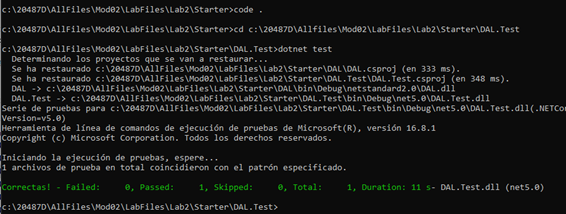

20487D_MOD02_LAK

\# Module 2: Querying and Manipulating Data Using Entity Framework

\# Lab: Creating a Data Access Layer using Entity Framework

 

 

\### Exercise 1: Creating a Data Model

\#### Task 1: Create a class library for the data model

 

\### Exercise 2: Query your database

 

\#### Task 1: Create a database initializer with dummy data

 

Task 2: Write a language-integrated query (LINQ) query to query the data

 

 

Resultado de Exercise 2,  Task 2

 

**Lab: Manipulating Data**

**Exercise 1: Create repository methods**

 

\### Exercise 2: Test the model using SQL Server and SQLite

 

\#### Task 1: Create test code with transactions

 

Resultado:

 

#### Task 3: Replace the SQL Server provider with SQLite

 

 

 

 

 

 